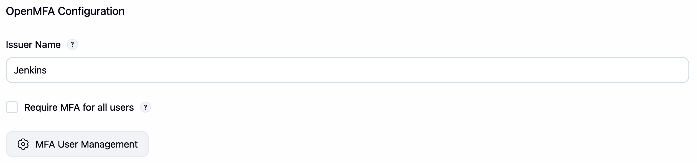
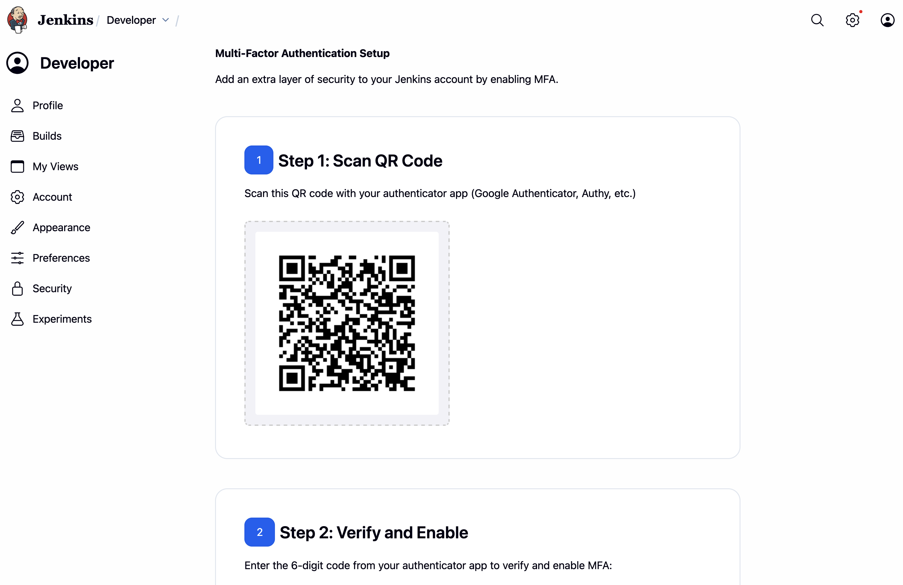
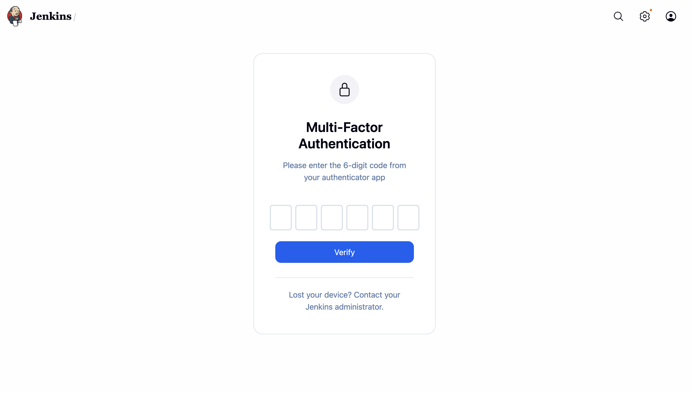
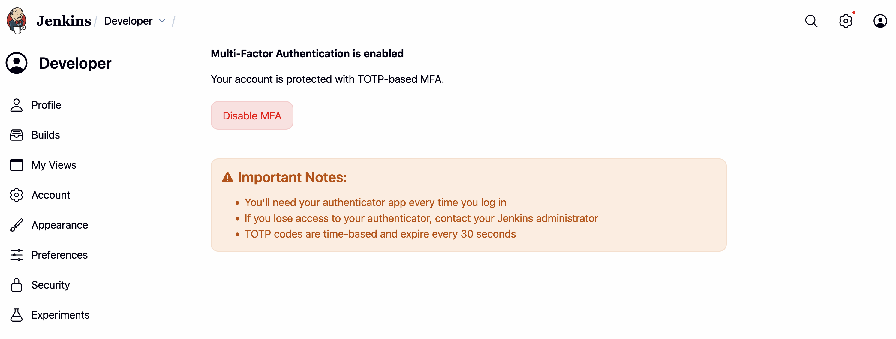
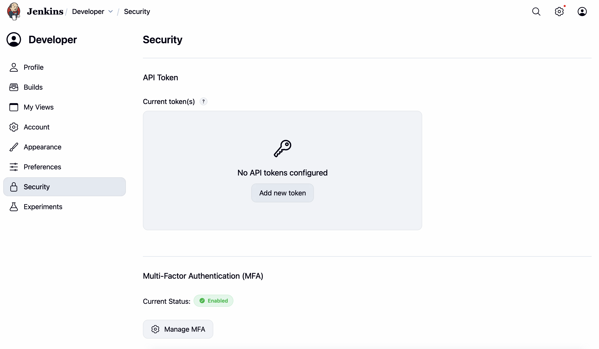
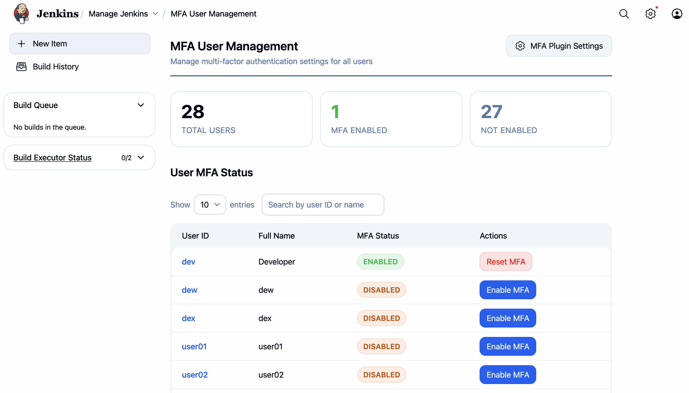

# OpenMFA Plugin

[](https://raw.githubusercontent.com/jenkinsci/openmfa-plugin/master/LICENSE.md)
[](https://plugins.jenkins.io/openmfa)
[](https://github.com/jenkinsci/openmfa-plugin/releases/latest)
[](https://plugins.jenkins.io/openmfa)


OpenMFA is a [Jenkins](https://www.jenkins.io/) plugin that adds TOTP-based MFA for interactive logins.
It introduces setup, verification, and management flows for user accounts inside Jenkins.

## Table of Contents

- [OpenMFA Plugin](#openmfa-plugin)
  - [Table of Contents](#table-of-contents)
  - [Features](#features)
  - [Requirements](#requirements)
  - [Getting Started](#getting-started)
  - [User Flow](#user-flow)
  - [MFA User Management](#mfa-user-management)
  - [Configuration as Code (JCasC)](#configuration-as-code-jcasc)
  - [Security Notes](#security-notes)
  - [Development](#development)
    - [VS Code Debugging](#vs-code-debugging)
    - [Using the `.env` File](#using-the-env-file)
    - [Code Style](#code-style)
  - [License](#license)

## Features

- TOTP MFA using authenticator apps (RFC 6238 compatible)
- QR-based enrollment flow for end users
- Global admin configuration for issuer and enforcement
- MFA user management page for administrators
- Session-based MFA verification after primary login
- Basic brute-force protection on code verification attempts
- Supports Jenkins dark theme for all UI elements

## Requirements

- Jenkins `2.516.3` or newer

## Getting Started

1. Install the plugin from the [Jenkins Plugin Manager](https://plugins.jenkins.io/openmfa-plugin/) or build it from source.
2. Go to `Manage Jenkins` -> `Security` -> `OpenMFA Configuration`.
3. Configure:
   - `Issuer Name`
   - `Require MFA for all users`
4. Save settings.
5. Ask users to enroll via the OpenMFA setup page before broad enforcement.

**Showcases**


(OpenMFA Global Configuration: `Manage Jenkins` > `Security` > `OpenMFA Configuration`)

## User Flow

1. User signs in with username/password.
2. If MFA is required and the user is not enrolled, user is redirected to MFA setup.
3. User scans QR code in authenticator app and verifies setup.
4. On future logins, user enters a 6-digit TOTP code.

**Showcases**


(MFA setup page: `User Property` > `Security` > `Setup MFA`)


(MFA login challenge: after Jenkins `login`)


(MFA enabled: `User Property` > `Security` > `Manage MFA` )


(MFA enabled: `User Property` > `Security`)

## MFA User Management

- Go to `Manage Jenkins` > `MFA User Management`.
- Use this page to inspect enrollment state and perform admin-side MFA operations.

**Showcases**


(MFA user management: `Manage Jenkins` > `MFA User Management`)

## Configuration as Code (JCasC)

This plugin exposes global configuration and can be managed through Jenkins Configuration as Code.

Recommended workflow:

1. Configure OpenMFA once from the Jenkins UI.
2. Export current JCasC from your Jenkins instance.
3. Copy the OpenMFA section into your managed JCasC repository.
4. Apply via your standard `CASC_JENKINS_CONFIG` workflow.

Example shape (keys may vary by controller/JCasC export; use exported keys as source of truth):

```yaml
unclassified:
  <openmfa-global-config-key>:
    issuer: 'Jenkins'
    requireMFA: true
```

## Security Notes

- Treat JCasC files and Jenkins configuration files as privileged, since they control authentication behavior.
- API token authentication is not challenged with interactive MFA.
- OpenMFA uses per-session verification and redirects back to the original destination after successful MFA.

## Development

The `maven-hpi-plugin` offers important commands for Jenkins plugin development:

- **Build and package your plugin (.hpi):**

  ```bash
  mvn install
  ```

  This compiles the plugin and creates the `.hpi` file (e.g., `target/openmfa-plugin.hpi`), suitable for installation in Jenkins.

- **Run Jenkins in development mode with your plugin:**
  ```bash
  mvn hpi:run
  ```
  This starts a local Jenkins controller instance with your plugin pre-installed, typically at [http://localhost:8080/jenkins/](http://localhost:8080/jenkins/).

### VS Code Debugging

If you use Visual Studio Code, the repo includes a sample `.vscode/launch.json` for debugging Jenkins plugin development:

- **Debug Jenkins Plugin**:
  Attaches to a Jenkins process started with `mvn hpi:run` in debug mode (`-Dmaven.surefire.debug`), listening on port `5005`.

- **Debug Jenkins Plugin (mvnDebug)**:
  Attaches to Jenkins launched with `mvnDebug`, typically listening on port `8000`.

To use:

1. Open this repository in VS Code.
2. In VS Code, go to the "Run and Debug" panel and select a launch configuration.

You can set breakpoints in your Java code immediately.

### Using the `.env` File

You can configure your development environment by creating a `.env` file in the project root. This file is used to provide environment variables, such as `JAVA_HOME`, which are required for Maven or Jenkins commands.

- **Sample `.env` file:**
  ```
  JAVA_HOME=/path/to/your/java
  # JENKINS_HOME=/path/to/jenkins_home (optional)
  ```

**How to use:**

1. Copy `.env.example` to `.env`:
   ```bash
   cp .env.example .env
   ```
2. Edit `.env`, setting `JAVA_HOME` to your local Java installation and any other variables as needed.
3. The `.env` file is automatically loaded when running development commands via the provided `.vscode/run.sh` (used in `vscode/tasks.json`) script, ensuring your environment variables (like `JAVA_HOME`) are available.

**Tip:**
`.env` is ignored by git, so your local secrets and paths are not committed. Use `.env.example` as a starting point for other developers.

### Code Style

This project uses Spotless with Eclipse formatter rules from `fmt.xml`. It also ships a `prek` config in `.pre-commit-config.yaml`.

- Install git hooks with `prek`:

  ```bash
  prek install
  ```

- Run all configured checks/formatters with `prek`:

  ```bash
  prek run --all-files
  ```

- Check formatting:

  ```bash
  mvn spotless:check
  ```

- Apply formatting:
  ```bash
  mvn spotless:apply
  ```

Spotless checks are also executed during Maven `compile`, so formatting issues fail the build.

## License

MIT. See `LICENSE.md`.
