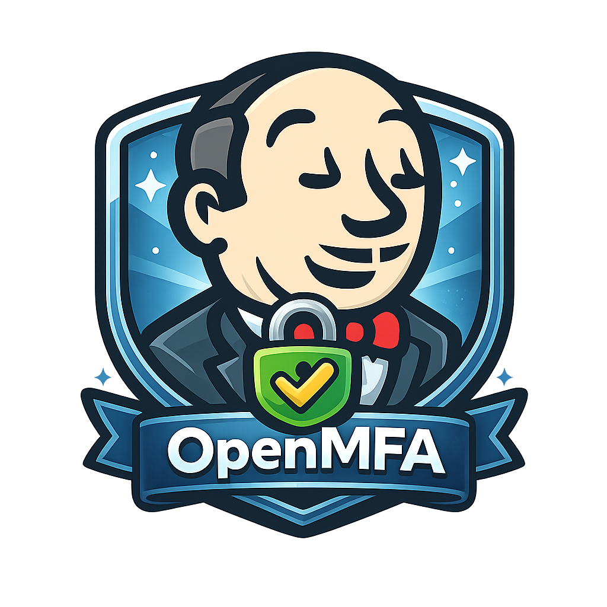
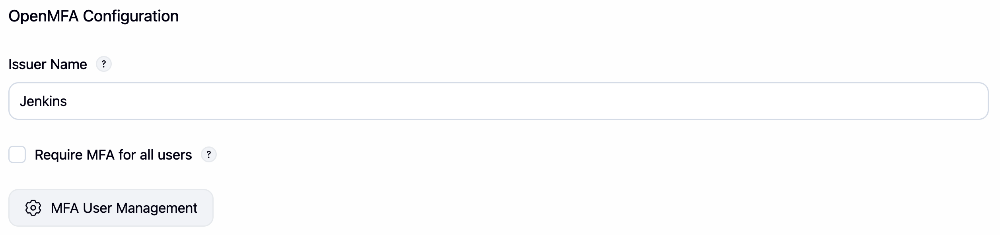
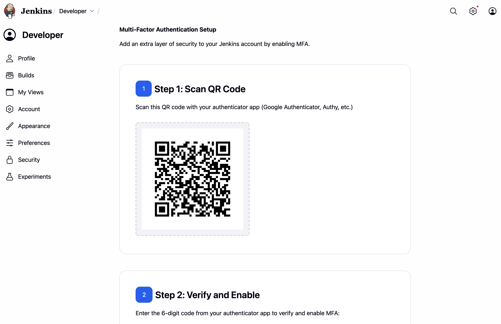
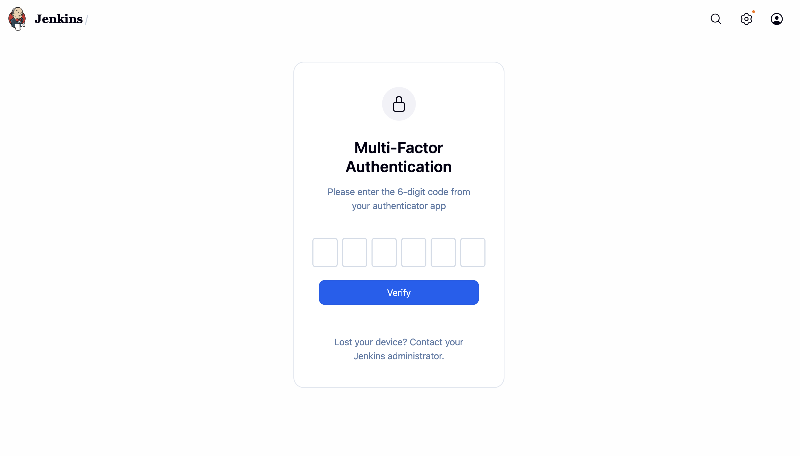
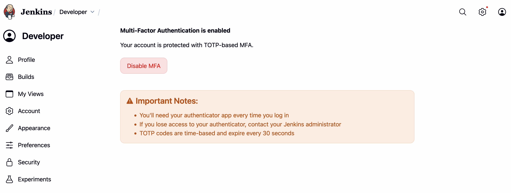
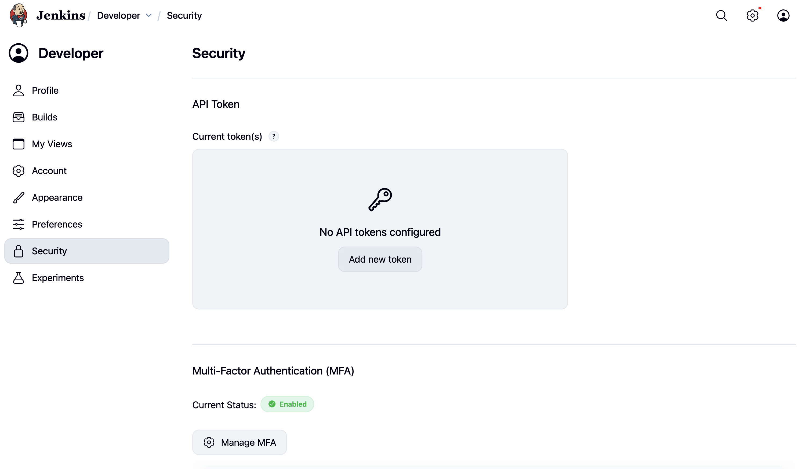
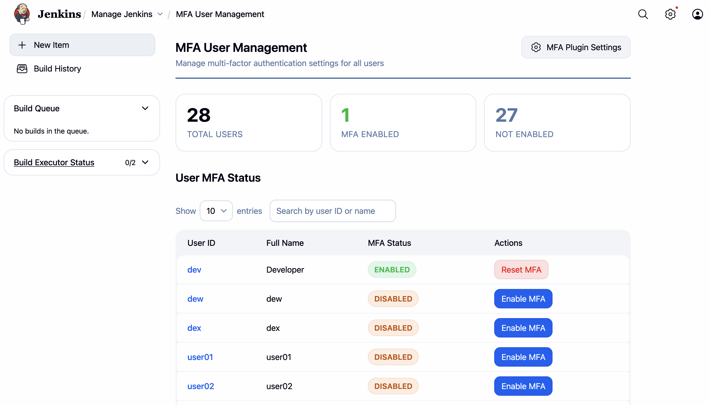

# OpenMFA Plugin

[](https://raw.githubusercontent.com/jenkinsci/openmfa-plugin/master/LICENSE.md)
[](https://plugins.jenkins.io/openmfa)
[](https://github.com/jenkinsci/openmfa-plugin/releases/latest)
[](https://plugins.jenkins.io/openmfa)



OpenMFA is a [Jenkins](https://www.jenkins.io/) plugin that adds TOTP-based MFA for interactive logins.
It introduces setup, verification, and management flows for user accounts inside Jenkins.

## Table of Contents

- [OpenMFA Plugin](#openmfa-plugin)
  - [Table of Contents](#table-of-contents)
  - [Features](#features)
  - [Requirements](#requirements)
  - [Getting Started](#getting-started)
  - [User Flow](#user-flow)
  - [MFA User Management](#mfa-user-management)
  - [Remember MFA ("Keep me signed in")](#remember-mfa-keep-me-signed-in)
  - [Configuration as Code (JCasC)](#configuration-as-code-jcasc)
  - [MFA Exemptions](#mfa-exemptions)
  - [Ephemeral JENKINS_HOME (Kubernetes / jenkins-operator)](#ephemeral-jenkins_home-kubernetes--jenkins-operator)
  - [Security Notes](#security-notes)
  - [Development](#development)
    - [VS Code Debugging](#vs-code-debugging)
    - [Using the `.env` File](#using-the-env-file)
    - [Code Style](#code-style)
  - [License](#license)

## Features

- TOTP MFA using authenticator apps (RFC 6238 compatible)
- QR-based enrollment flow for end users
- Global admin configuration for issuer and enforcement
- MFA user management page for administrators
- Session-based MFA verification after primary login
- Remember MFA across sessions for users who check "Keep me signed in"
  (signed cookie, configurable duration, disabled by setting it to 0)
- Basic brute-force protection on code verification attempts
- Supports Jenkins dark theme for all UI elements
- Configurable exemptions for service accounts and specific roles

## Requirements

- Jenkins `2.568.3` or newer

## Getting Started

1. Install the plugin from the [Jenkins Plugin Manager](https://plugins.jenkins.io/openmfa-plugin/) or build it from source.
2. Go to `Manage Jenkins` -> `Security` -> `OpenMFA Configuration`.
3. Configure:
   - `Issuer Name`
   - `Require MFA for all users`
   - `Remember MFA for "Keep me signed in" (hours)` (default: 24, 0 disables)
   - `Exempt Users` (optional)
   - `Exempt Roles` (optional)
4. Save settings.
5. Ask users to enroll via the OpenMFA setup page before broad enforcement.

**Showcases**


(OpenMFA Global Configuration: `Manage Jenkins` > `Security` > `OpenMFA Configuration`)

## User Flow

1. User signs in with username/password.
2. If MFA is required and the user is not enrolled, user is redirected to MFA setup.
3. User scans QR code in authenticator app and verifies setup.
4. On future logins, user enters a 6-digit TOTP code.

**Showcases**


(MFA setup page: `User Property` > `Security` > `Setup MFA`)


(MFA login challenge: after Jenkins `login`)


(MFA enabled: `User Property` > `Security` > `Manage MFA` )


(MFA enabled: `User Property` > `Security`)

## MFA User Management

- Go to `Manage Jenkins` > `MFA User Management`.
- Use this page to inspect enrollment state and perform admin-side MFA operations.

**Showcases**


(MFA user management: `Manage Jenkins` > `MFA User Management`)

## Remember MFA ("Keep me signed in")

By default, MFA verification lives only in the HTTP session, so every new
session (new browser session, session timeout, controller restart) triggers a
new MFA challenge -- even for users who checked Jenkins' "Keep me signed in"
at login.

With this feature, users who logged in with "Keep me signed in" receive a
long-lived `openmfa-remember` cookie after passing MFA and are not challenged
again until it expires. Users who log in without "Keep me signed in" keep the
per-session behavior.

How it works:

- The cookie is a stateless, HMAC-SHA256-signed token bound to the username,
  an absolute expiry, and a hash of the user's current TOTP secret. Nothing is
  stored server-side per device.
- Duration is configured by `Remember MFA for "Keep me signed in" (hours)`
  (default: 24). Setting it to `0` disables the feature entirely.
- Re-enrolling or disabling MFA changes the TOTP secret and therefore
  invalidates all previously issued cookies for that user.
- Logging out clears the cookie.
- The signing key is generated automatically on first use and persisted in the
  global configuration. Rotating the key (or setting a new one via JCasC)
  immediately invalidates all issued remember-MFA cookies -- this is the
  emergency "forget all remembered devices" switch.

No configuration is required on a standard installation with a persistent
`JENKINS_HOME`. For ephemeral setups, see
[Ephemeral JENKINS_HOME](#ephemeral-jenkins_home-kubernetes--jenkins-operator).

## Configuration as Code (JCasC)

This plugin exposes global configuration and can be managed through Jenkins Configuration as Code.

Recommended workflow:

1. Configure OpenMFA once from the Jenkins UI.
2. Export current JCasC from your Jenkins instance.
3. Copy the OpenMFA section into your managed JCasC repository.
4. Apply via your standard `CASC_JENKINS_CONFIG` workflow.

Example:

```yaml
security:
  openMFA:
    issuer: 'Jenkins'
    requireMFA: true
    rememberMfaHours: 24
    # Optional. Omit to let the plugin generate and persist a key in
    # JENKINS_HOME. Set it explicitly (via any JCasC secret source, e.g.
    # Vault, env var, or mounted secret) when JENKINS_HOME is ephemeral,
    # so remember-MFA cookies survive restarts.
    rememberMfaKey: ${OPENMFA_REMEMBER_KEY}
    exemptUsers:
      - svc-deploy
      - break-glass
    exemptRoles:
      - ci-agents
      - service-accounts
```

## MFA Exemptions

You can exempt specific users or roles from MFA requirements:

- **Exempt Users**: Individual usernames that bypass MFA (case-insensitive)
- **Exempt Roles**: Group/role names that bypass MFA for all members

Exemptions are useful for:

- Service accounts used by CI/CD pipelines
- Emergency break-glass accounts
- Automated agents that cannot complete MFA

**Note:** Exempted users bypass MFA entirely. Do not exempt regular user accounts.

## Ephemeral JENKINS_HOME (Kubernetes / jenkins-operator)

On setups where `JENKINS_HOME` does not survive restarts (e.g.
[jenkins-operator](https://github.com/jenkinsci/kubernetes-operator) with its
default ephemeral home), two pieces of state need attention:

- **Remember-MFA signing key** -- set `rememberMfaKey` via JCasC from an
  external secret source (Vault, Kubernetes Secret, env var). The key is then
  re-applied on every boot and issued cookies stay valid across pod restarts.
  Without it, each fresh instance generates a new key and all remembered
  devices are challenged again.
- **User TOTP enrollments** -- stored by Jenkins in `$JENKINS_HOME/users/` and
  encrypted with `$JENKINS_HOME/secrets/master.key`. These are runtime user
  data and cannot come from configuration: persist `users/` and `secrets/`
  together (PVC mounts or backup/restore), always as a pair -- one without the
  other is unusable.

## Security Notes

- Treat JCasC files and Jenkins configuration files as privileged, since they control authentication behavior.
- API token authentication is not challenged with interactive MFA. Basic auth with a real password is challenged; use API tokens for scripted access.
- OpenMFA uses per-session verification and redirects back to the original destination after successful MFA.
- The remember-MFA cookie is `HttpOnly`, `Secure` on HTTPS, HMAC-SHA256 signed
  with constant-time comparison, and carries no secret material -- only the
  username, expiry, and signature.

## Development

The `maven-hpi-plugin` offers important commands for Jenkins plugin development:

- **Build and package your plugin (.hpi):**

  ```bash
  mvn install
  ```

  This compiles the plugin and creates the `.hpi` file (e.g., `target/openmfa-plugin.hpi`), suitable for installation in Jenkins.

- **Run Jenkins in development mode with your plugin:**
  ```bash
  mvn hpi:run
  ```
  This starts a local Jenkins controller instance with your plugin pre-installed, typically at [http://localhost:8080/jenkins/](http://localhost:8080/jenkins/).

### VS Code Debugging

If you use Visual Studio Code, the repo includes a sample `.vscode/launch.json` for debugging Jenkins plugin development:

- **Debug Jenkins Plugin**:
  Attaches to a Jenkins process started with `mvn hpi:run` in debug mode (`-Dmaven.surefire.debug`), listening on port `5005`.

- **Debug Jenkins Plugin (mvnDebug)**:
  Attaches to Jenkins launched with `mvnDebug`, typically listening on port `8000`.

To use:

1. Open this repository in VS Code.
2. In VS Code, go to the "Run and Debug" panel and select a launch configuration.

You can set breakpoints in your Java code immediately.

### Using the `.env` File

You can configure your development environment by creating a `.env` file in the project root. This file is used to provide environment variables, such as `JAVA_HOME`, which are required for Maven or Jenkins commands.

- **Sample `.env` file:**
  ```
  JAVA_HOME=/path/to/your/java
  # JENKINS_HOME=/path/to/jenkins_home (optional)
  ```

**How to use:**

1. Copy `.env.example` to `.env`:
   ```bash
   cp .env.example .env
   ```
2. Edit `.env`, setting `JAVA_HOME` to your local Java installation and any other variables as needed.
3. The `.env` file is automatically loaded when running development commands via the provided `.vscode/run.sh` (used in `vscode/tasks.json`) script, ensuring your environment variables (like `JAVA_HOME`) are available.

**Tip:**
`.env` is ignored by git, so your local secrets and paths are not committed. Use `.env.example` as a starting point for other developers.

### Code Style

This project uses Spotless with Eclipse formatter rules from `fmt.xml`. It also ships a `prek` config in `.pre-commit-config.yaml`.

- Install git hooks with `prek`:

  ```bash
  prek install
  ```

- Run all configured checks/formatters with `prek`:

  ```bash
  prek run --all-files
  ```

- Check formatting:

  ```bash
  mvn spotless:check
  ```

- Apply formatting:
  ```bash
  mvn spotless:apply
  ```

Spotless checks are also executed during Maven `compile`, so formatting issues fail the build.

## License

MIT. See `LICENSE.md`.
